Welcome to the detailed documentation of our project. This guide will help you understand the various features and functionalities available.

#  Getting Started
- Please download the file labelled in the format *SABERvx.y.z* from latest release of the tool from [Releases](https://github.com/phaniarvind/SABER/releases).
- Extract this file to a directory of your choice. Double click on *RunSABER.exe* to launch the application.
- Please wait for a couple of minutes while the application loads. You may not see any activity on the screen during this time.
- Once the application loads, you will see the landing page as shown below:  

  

    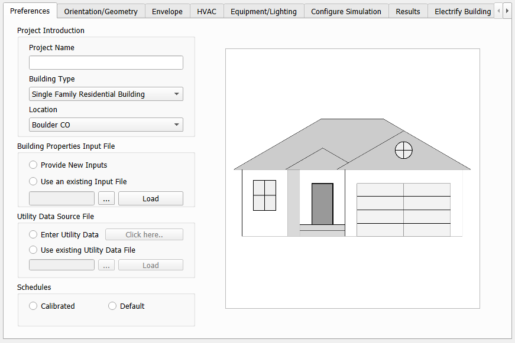
  

# Inputs
To run a case study in SABER, you will need to provide inputs to various screens in the application. Here, each input screen is explained in detail.

## Preferences
1. **Project Name**: Enter a name for your project. This will be used to create a folder to save all your case study files. If you are starting a new project, ensure that the project name is unique. If you are continuing with an existing project, select the same name as before.
2. **Building Type**: Select the type of building you are analyzing from the dropdown menu.
3. **Location**: Select the geographical location of the building from the dropdown menu. This will set the weather file.
4. **Building Properties Input File**: When starting a new project choose the *Provide New Inputs* option. When you click this, automatically a new folder will be created in the *Projects* folder with the name of your project. Inside this folder, you will find some input files specific to the building type you selected. Please ignore them for now. When you are continuing with an existing project, choose the *Use an existing Input File* option and browse to select the input file titled "*BldgPropInputFile-Baseline.pkl*" from the project folder. Do not forget to click *Load* after selecting the file.
5. **Utility Data Source File**: When starting a new project you have to provide the utility data mamnually. Choose the *Enter Utility Data* option and click on *Click here..*. This will open a new screen where you can enter the utility data. When you are continuing with an existing project, choose the Use an *Existing Utility Data File* option and browse to select the input file titled "*[YourProjectName]_UtilityData.csv*" from the project folder.
6. **Schedules**: Choose the schedule file you wish to use. When starting a new project, please choose *Default*. If you are continuing an existing project, please choose *Calibrated*.

## Orientation/Geometry
After finishing the Preferences screen, click on Orientation/Geometry to proceed to the next input screen. It will look like the following:

  

    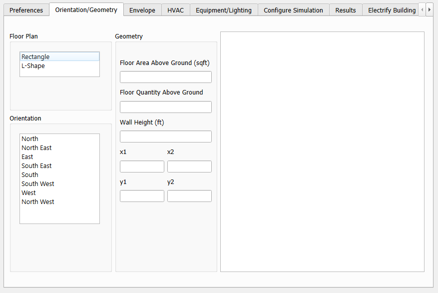
  

1. **Floor Plan**: Choose the appropriate floor plan for your building type. 
2. **Orientation**: Typically orientation is the direction that the main entrance of the building faces. However, as you see in the figure on the right, it is possible that the orientation of the main entrance in the figure does not align with your floor plan. In that case, ingore the main entrance in the figure and choose the orientation that aligns with your floor plan. The layout of the building will rotate so choose the orientation that matches with how your building is laid out on the site.
3. **Floor Area Above Ground (sft)**: Enter the total floor area of the building above ground level in square feet. Do not inlcude basement area.
4. **Floor Quantitiy Above Ground**: Enter the total number of floors above ground level. In cases of semi-basement, if the space is conditioned assume it as a full floor.
5. **Wall Height (ft)**: Enter the height of the walls from floor to ceiling in feet. An average value is acceptable.
6. **x1, x2, y1, y2**: These are shape parameters that define the geometry of the building. Please refer to the figure on the right for clarification. Enter the values in feet. If x2 and y2 don't apply to your building geometry, please enter 0.

## Envelope
Envelope has several screens, we shall go through them one by one.

### Exterior Wall
  

    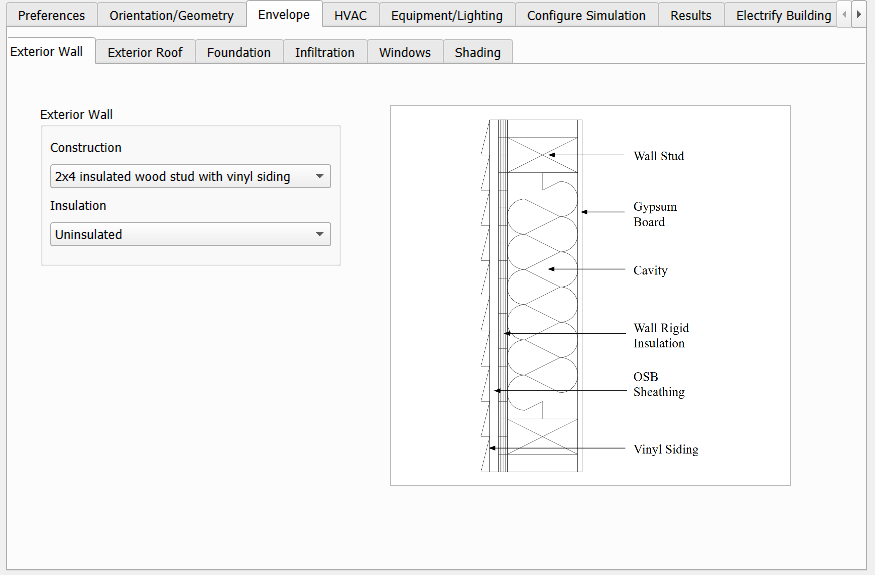
  

1. **Construction**: Choose the construction type of the exterior walls from the dropdown menu.
2. **Insulation Level**: Choose the insulation level of the exterior walls from the dropdown menu. Choose the closest match if your exact insulation level is not listed.

### Exterior Roof
  

    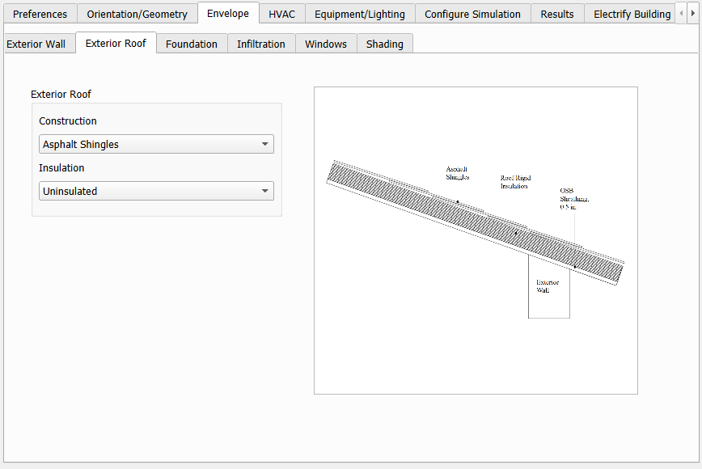
  

1. **Construction**: Choose the construction type of the exterior roof from the dropdown menu.
2. **Insulation Level**: Choose the insulation level of the exterior roof from the dropdown menu. Choose the closest match if your exact insulation level is not listed.

### Foundation
  

    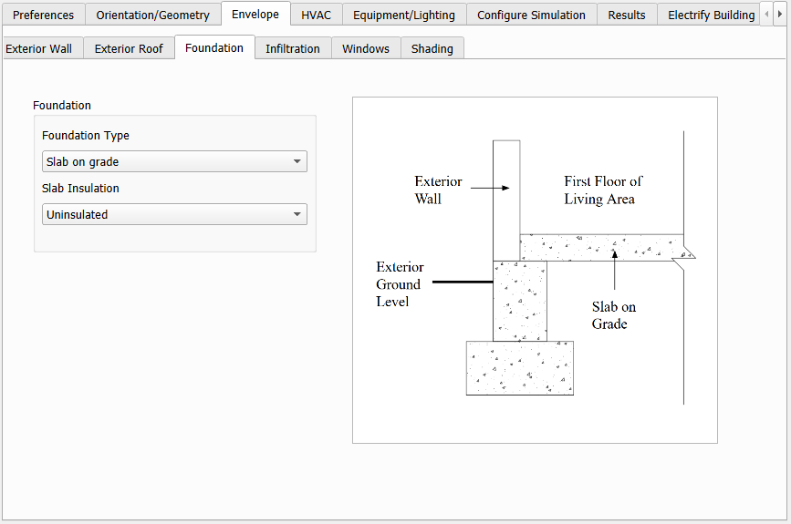
  

1. **Foundation Type**: Choose the type of foundation your building has from the dropdown menu.
2. **Insulation Level**: As of now SABER does not implement foundation insulation. This will be added in future releases.

### Infiltration

  

    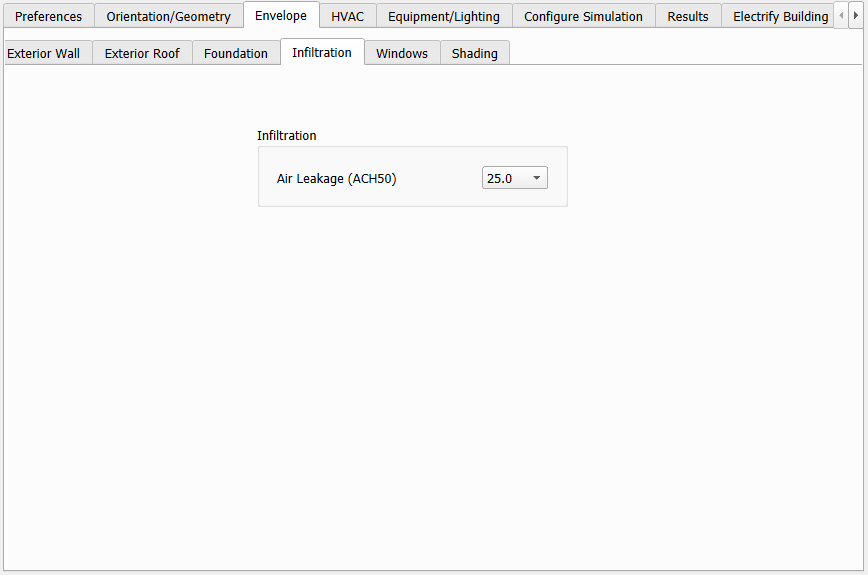
  

1. **Air Leakage Rate (ACH50)**: Enter the air leakage rate of the building in Air Changes per Hour at 50 Pascals. The ACH at 4Pa which is what you typically refer to when you say ACH is related to ACH50 by a factor of approximately 20. The average building has an ACH of 0.35 which corresponds to an ACH50 of 7.0. If you do not have a blower door test result for your building, you may use this value.

### Windows
  

    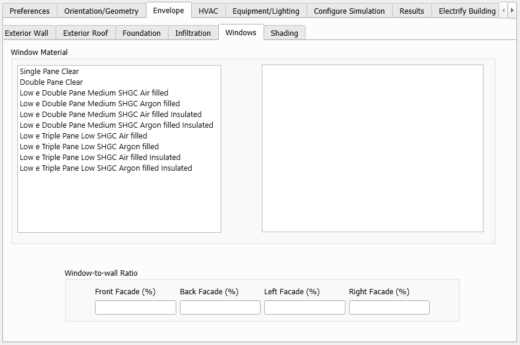
  

1. **Window Material**: Choose the window material from the dropdown menu that closely matches your window specifications.
2. **Window-to-Wall Ratio (WWR) Front, Back, Left, Right**: Enter the window-to-wall ratio for each facade of the building. This is the ratio of the window area to the wall area on that facade. If you do not have exact values, you may estimate them visually. The Front here refers to the *Front Door* direction selected in the Orientation/Geometry screen. If it does not match the building front, ignore the actual front of the building and estimate the WWRs based on the selected Front Door direction.

### Shading
  

    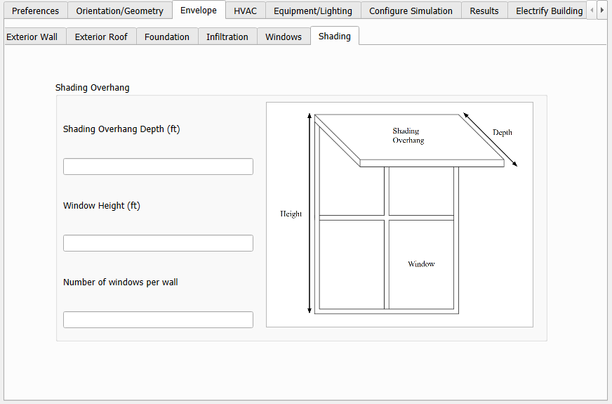
  
  

1. **Shading Overhang Depth (ft)**: Enter the depth of the overhangs above the windows in feet. If there are no overhangs, enter 0.
2. **Window Height (ft)**: Enter the average height of the windows from the bottom of the window to the top of the window in feet.
3. **Number of windows per wall**: This parameter will decide the approximate window distribution on each facade. The windows will be assumed to be evenly distributed on that facade. 

## HVAC Systems
The HVAC systems input has multiple screens. We shall go through them one by one.

### Cooling Equipment
  

    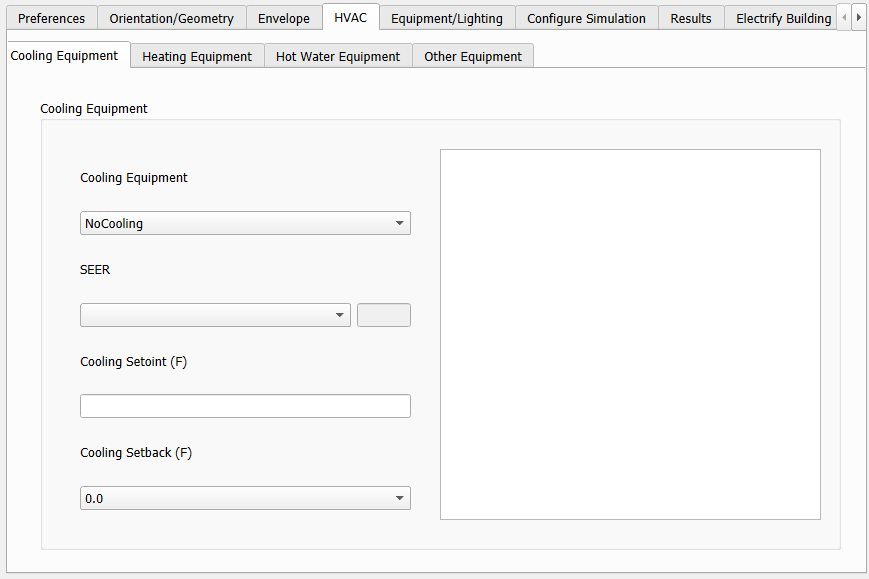
  

1. **Cooling Equipment**: Choose the type of cooling system your building has from the dropdown menu. Currently only Air Conditioner (AC) and Heat Pump (HP) are supported.
2. **SEER**: Choose the average SEER rating of your cooling equipment from the dropdown menu. If exact rating is not available, choose *Other..* and enter the SEER value in the box that appears.
3. **Cooling Setpoint (F)**: Enter the cooling setpoint temperature in Fahrenheit. If no cooling equipment is present, please enter a value of 0 here.
4. **Cooling Setback (F)**: This is not yet supported. Please leave it as is.

### Heating Equipment
  

    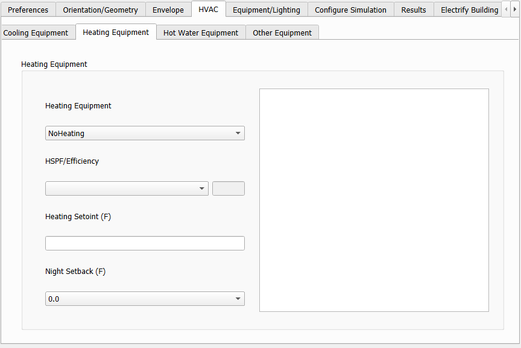
  

1. **Heating Equipment**: Choose the type of heating system your building has from the dropdown menu. Currently only Electric Resistance (ER), Gas Furnace (GF) and Heat Pump (HP) are supported.
2. **HSPF/Efficiency**: Choose the average heating efficiency of your heating equipment from the dropdown menu. If exact rating is not available, choose *Other..* and enter the HSPF or Efficiency value in the box that appears.
3. **Heating Setpoint (F)**: Enter the heating setpoint temperature in Fahrenheit. If no heating equipment is present, please enter a value of 0 here.
4. **Night Setback (F)**: Choose the closest night setback temperature in Fahrenheit from the dropdown menu. 

### Hot Water Equipment
  

    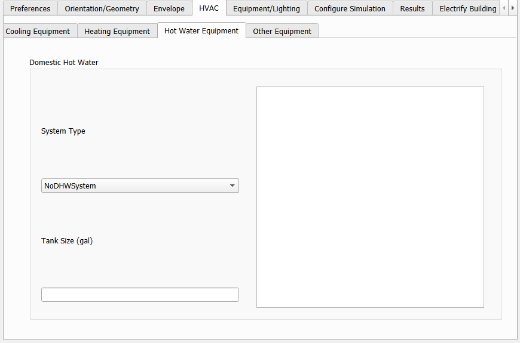
  

1. **System Type**: Choose the type of hot water system your building has from the dropdown menu. Currently only Electric Water Heater (EWH) and Gas Water Heater (GWH) are supported.
2. **Tank Size (gal)**: Input the tank size of your hot water system in gallons.

### Other Equipment
  

    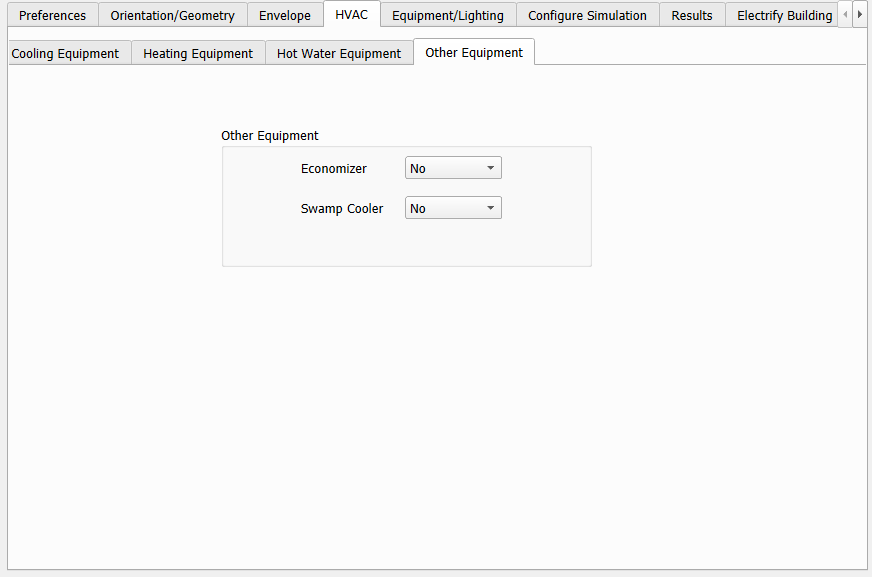
  

This is not yet supported. Please leave it as is.

## Equipment/Lighting
The Equipment/Lighting input has 2 screens. We shall go through them one by one.

### Electric Equipment
  

    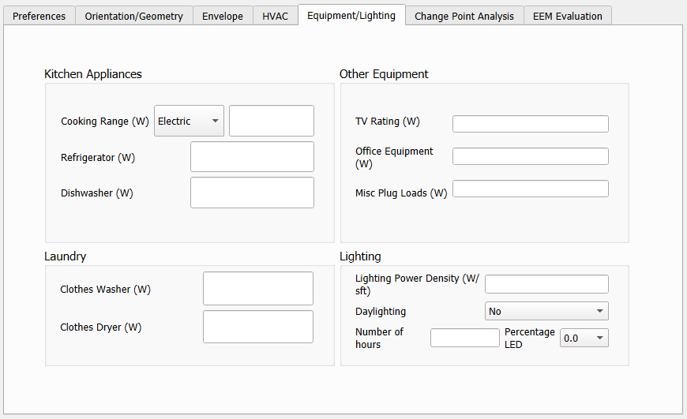
  

1. **Electric Equipment**: Please enter the approximate wattage rating of each electric equipment in the building. This includes appliances, plug loads, and any other electric equipment that is not part of the HVAC system. If you do not have exact values, you can estimate them based on the number of equipment and their typical wattage. If there is no electric equipment, please enter 0. If there is more than one of a particular equipment, please enter the total wattage for all of them combined. For example, if you have 10 laptops each with a wattage of 50W, you can enter 500W here. This value is also calculated internally by the program so don't worry too much about the accuracy. 
2. **Lighting Power Density ($W/ft²$)**: Enter the value of lighting power density in watts per square foot. This is the total wattage of all the lighting fixtures in the building divided by the total floor area of the building. If you do not have exact values, you can estimate them based on the number of fixtures and their typical wattage. If there is no electric equipment, please enter 0.
3. **Daylighting**: Choose if building has daylighting controls.
4. **Number of hours**: The approximate number of hours the lighting is on during the day. This will be used to calculate the total lighting energy end-use for each day by: $LPD \times FloorArea \times N_h $.

**Note**: *Please be careful when choosing the number of hours of operation. You have to take care to ensure that the total lighting energy consumption does not exceed the baseload energy consumption from the utility data. If that happens the calculated electric equipment energy consumption will be negative and the program will crash. *

# Run Analysis
## Weather
  

    
  

The first screen of the this section is the Weather screen. Based on the address of the building you entered in the Preferences screen, the weather file will be automatically set. 
1. **Get Weather Data**: Click on this to fetch the weather data for your location. The data will be fetched from the internet and will be saved in your project folder. From then on it will just be read from the project folder so you don't have to worry about internet connectivity after this step. 
2. **Set Selections**: After fetching the weather data, click on this button to set the selections for the simulation. This will set the inputs for the simulation based on the weather data and the other inputs you have provided. This step is important. It will create the baseline input file for the simulation. If you have made any changes to the inputs after this step, make sure to click on this button again to update the baseline input file before running the simulation.

## Temperature Based Analysis
  

    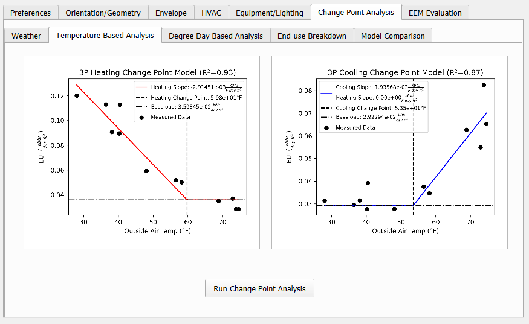
  

Here you can run the temperature based change point analysis. You will click on Run Change Point Analysis to run the analysis. This will run a regression analysis to find the change points in the temperature data that correspond to the heating and cooling energy consumption. The results of the change point analysis will be saved in your project folder under * Projects > [YourProjectName]  > Results *. Sometimes the change point analysis may yield three plots one for electric heating and cooling and one for gas heating. In that case, only the gas heating and electric cooling will be shown here but the remaining one can be found in the Results folder.

## Degree Day Based Analysis
  

    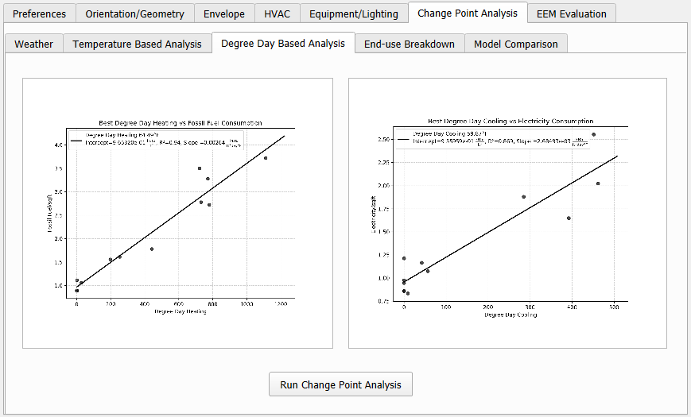
  

Navigate to the Degree Day Based Analysis screen to run the degree day based change point analysis based on the Variable Base Degree Day Method. This will run a regression analysis to find the change points in the degree day data that correspond to the heating and cooling energy consumption. The results of the change point analysis will be saved in your project folder under * Projects > [YourProjectName]  > Results *.

## End-Use Breakdown
  

    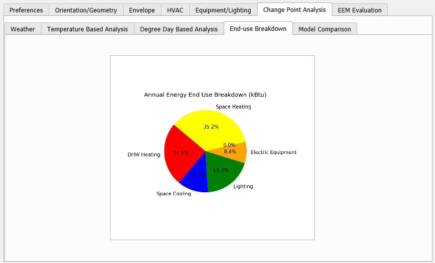
  

Here you find the end-use breakdown of the energy consumption for your building. This will show you the breakdown of the energy consumption by different end-uses such as heating, cooling, hot water, electric equipment, and lighting. This will be based on the change point analysis results and the inputs you have provided. The results will be saved in your project folder under * Projects > [YourProjectName]  > Results *.

## Model Comparison
  

    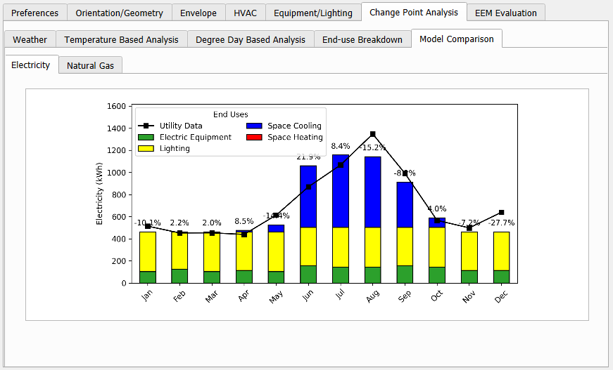
  

Based on the change point analysis the best fit model will be selected for the simulation. You can compare the simulated energy consumption with the actual energy consumption from utility data in this screen for each month in electricity and natural gas. The results will be saved in your project folder under * Projects > [YourProjectName]  > Results *.

# EEM Evaluation
To evaluate various energy efficiency measures (EEMs) for your building, click on the *EEM Evaluation* button in the *Configure Simulation* screen. Now navigate to this screen that will have two sub-screens.

## Economic Data:
   
  

    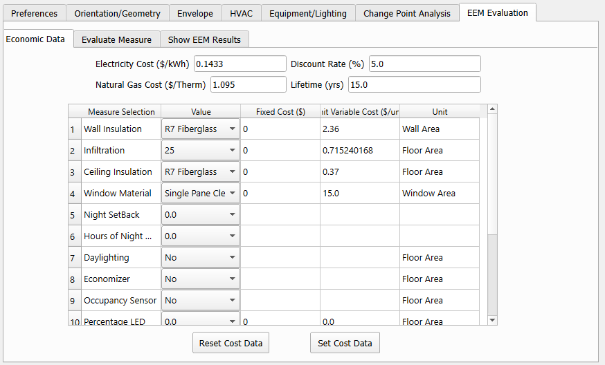
  

Here you can choose the economic data that you will use for your EEM evaluation. You can either use the default economic data provided in the tool or you can edit these values and save them specific to your project. 
1. **Electricity Cost (\$/kWh)**: Cost of electricity in $/kWh.
2. **Gas Cost (\$/therm)**: Cost of natural gas in $/therm.
3. **Discount Rate (%)**: Discount rate to be used for calculating life cycle cost (LCC).
4. **Lifetime (yrs)**: Analysis period in years for calculating life cycle cost (LCC).
5. **Measure Selection**: Choose the EEM you wish to examine the cost of from the dropdown menu.
6. **Value**: Choose the specific value for the selected EEM from the dropdown menu.
7. **Fixed Cost ($)**: This will be populated automatically based on your selections.
8. **Variable Cost ($/unit)**: This will be populated automatically based on your selections.
9. **Unit**: This shows the unit for the variable cost. So the variable cost will be multiplied by the value of this unit to get the total variable cost.
10. **Set Cost Data**: After entering all the economic data, click on this button to save the data. Your project specific economic data will be saved in the *Projects>[YourProjectName]>CostData* folder.
11. **Reset Cost Data**: This will reset all the economic data to default values.

**Note: Irrespective of whether you choose to change anything here or not, please click on the *Set Cost Data* button to ensure that the economic data is saved in your project folder. This will be used for evaluating the EEMs in the next step.**

## Evaluate Measure
If you have clicked on EEM Evaluation from the *Configure Simulation* screen after running a simulation, the *Baseline Building Metrics* should appear automatically. If not, please ensure that you have run a simulation before proceeding. 

  

    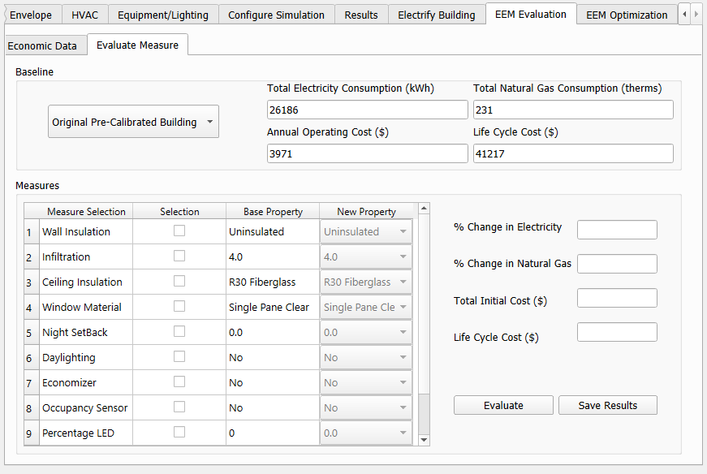
  

1. If you have clicked on Set Cost Data in the previous screen, the baseline tab will be automatically populated with the results from the simulation and the economic data you have entered. 
2. **Measure Selection**: Choose the EEM you wish to examine from the dropdown menu. Click the checkbox in the Selection column to select the measure. This will automatically enable the New Property column.
3. **New Property**: Choose the specific value for the selected EEM from the dropdown menu in the New Property column.
4. **Evaluate**: Clicking on this button will evaluate the selected EEM and populate the fields.
   - *% Change in Electricity*: Percentage change in annual electricity consumption compared to the baseline case.
   - *% Change in Gas*: Percentage change in annual gas consumption compared to the baseline case.
   - *Initial Cost ($)*: Initial cost of implementing the EEM.
   - *LCC ($)*: Life Cycle Cost of the EEM over the analysis period.
  
You can choose more than one EEM at a time and the whole package will be evaluated. At all points, all selected measures will be evaluated as a package and the results will be shown accordingly. 